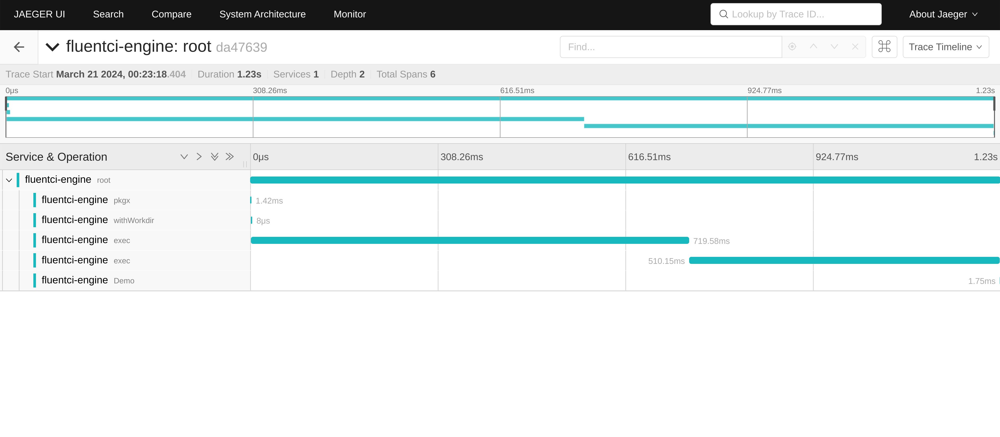
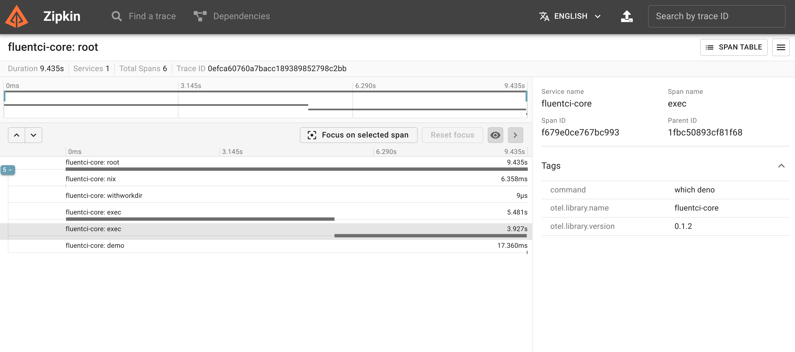

# FluentCI Engine

[](https://flakehub.com/flake/fluentci-io/fluentci-engine)
[](https://flakestry.dev/flake/github/fluentci-io/fluentci-engine)
[](https://crates.io/crates/fluentci-engine)
[](https://crates.io/crates/fluentci-engine)
[](https://github.com/fluentci-io/fluentci-engine/actions/workflows/ci.yml)
[](https://discord.gg/V4U6dPskKc)

FluentCI Engine is a programmable CI/CD engine that is designed to be simple, flexible, and easy to use. It is supposed to run on the host machine without containerization or virtualization, and it is designed to be used with [Nix](https://nixos.org), [Pkgx](https://pkgx.sh), [Devbox](https://www.jetpack.io/devbox/), [Flox](https://flox.dev), [Devenv](https://devenv.sh), [EnvHub](https://github.com/tsirysndr/envhub), [Pixi](https://pixi.sh/) and [Mise](https://mise.jdx.dev/).


> [!NOTE]
> **Project Status: 🐲 Unstable, alpha-ish quality.**
> This project is still in the early stages of development, 
> and it is not yet ready for production use. 
> It is not feature-complete, and it is not yet stable. Use at your own risk.

## ✨ Features

- [x] Simple and easy to use
- [x] Flexible
- [x] No containerization or virtualization
- [x] Built-in support for Nix, Pkgx, Devbox, Flox, Devenv, Envhub, Mise and Pixi
- [x] Cache support (backends: local, S3, GCS, R2)
- [x] SDK for writing pipelines in TypeScript, see [@fluentci/sdk](./sdk/typescript)
- [x] GraphQL API, see [API Documentation](./docs/api.md)
- [x] OpenTelemetry tracing
- [x] Plugin system in WebAssembly, see [examples](./examples)

## 🚀 Quick Start

```bash
# Clone the repository
git clone https://github.com/fluentci-io/fluentci-engine.git
# Go to the project directory
cd fluentci-engine
# Install dependencies
nix develop
cargo run -p fluentci-engine -- serve
# Open the browser and go to http://localhost:6880/graphiql
# See ./fixtures for some GraphQL queries examples
```

> [!TIP]
> Quickly setup Nix on your machine with [DeterminateSystems Nix installer](https://github.com/DeterminateSystems/nix-installer)

## 📚 Documentation

- [API Documentation](./docs/api.md)

## 🧩 Plugins

FluentCI Engine supports plugins in WebAssembly. You can write your own plugins in Rust or any other language that can compile to WebAssembly. See [examples](./examples) for more information.

### 🦀 Rust Plugin Example

Create a new Rust project:

```bash
cargo new nix --lib
```

Install the `extism_pdk` and `fluentci_pdk` crates:

```bash
cargo add extism_pdk fluentci_pdk
```

Save the following code to `src/lib.rs`:

```rust
use extism_pdk::*;
use fluentci_pdk::dag;

#[plugin_fn]
pub fn exec(command: String) -> FnResult<String> {
    let stdout = dag()
        .nix()?
        .with_exec(command.split_whitespace().collect())?
        .stdout()?;
    Ok(stdout)
}
```

Set the following in your `Cargo.toml`:

```toml
[lib]
crate-type = ["cdylib"]
```

Compile the plugin to WebAssembly:

```bash
cargo build --release --target wasm32-unknown-unknown
```

Run the plugin:

```bash
fluentci-engine call -m ./target/wasm32-unknown-unknown/release/nix.wasm -- exec nix --version
```

### 🌈 Builtin functions

FluentCI Plugin Development Kit ([fluentci_pdk](https://docs.rs/fluentci-pdk/latest/fluentci_pdk)) provides some builtin functions from that you can use in your plugins:

#### devbox

Setup a Devbox Environment.

Example:

```rust
dag()
  .devbox()?
  .with_exec(vec!["devbox", "version"])?
  .stdout()?;
```

#### devenv

Setup a Devenv Environment.

Example:

```rust
dag()
  .devenv()?
  .with_exec(vec!["devenv", "version"])?
  .stdout()?;
```

#### directory

Load a directory at the given path.

Example:

```rust
dag()
  .directory(".")?
  .with_exec(vec!["ls", "-la"])?
  .stdout()?;
```

#### envhub

Setup an EnvHub Environment.

Example:

```rust
dag()
  .envhub()?
  .with_exec(vec!["envhub", "--version"])?
  .stdout()?;
```

#### file

Load a file at the given path.

Example:

```rust
dag()
  .file("Cargo.toml")?
  .path()?;
```

#### flox

Setup a Flox Environment.

Example:

```rust
dag()
  .flox()?
  .with_exec(vec!["flox", "--version"])?
  .stdout()?;
```

#### git

Load a Git repository at the given URL.

Example:

```rust
dag()
  .git("https://github.com/tsirysndr/me")?
  .branch("main")?
  .tree()?
  .entries()?;
```

#### http

Load a HTTP resource at the given URL.

Example:

```rust
dag()
  .http("https://example.com")?
  .path()?;
```

#### mise

Setup a Mise Environment.

Example:

```rust
dag()
  .mise()?
  .with_exec(vec!["mise", "--version"])?
  .stdout()?;
```

#### nix

Setup a Nix Environment.

Example:

```rust
dag()
  .nix()?
  .with_exec(vec!["nix", "--version"])?
  .stdout()?;
```

#### pipeline

Create a new pipeline.

Example:

```rust
dag()
  .pipeline("example")?
  .with_exec(vec!["echo", "Hello, World!"])?
  .stdout()?;
```

#### pixi

Setup a Pixi Environment.

Example:

```rust
dag()
  .pixi()?
  .with_exec(vec!["pixi", "--version"])?
  .stdout()?;
```

#### pkgx

Setup a Pkgx Environment.

Example:

```rust
dag()
  .pkgx()?
  .with_exec(vec!["pkgx", "--version"])?
  .stdout()?;
```

## ⚡ Caching

FluentCI Engine supports caching. To enable it, set the following environment variables:

- `FLUENTCI_CACHE_GCS_BUCKET` - GCS bucket name, if you are using Google Cloud Storage
- `FLUENTCI_CACHE_S3_ENDPOINT` - S3 endpoint, if you are using S3-compatible storage
- `FLUENTCI_CACHE_S3_BUCKET` - S3 bucket name, if you are using S3-compatible storage
- `FLUENTCI_CACHE_CDN_ENDPOINT` - CDN endpoint, if you are using CDN (optional) for downloading cache

> [!NOTE]
> You need to set `GOOGLE_APPLICATION_CREDENTIALS` or `AWS_ACCESS_KEY_ID` and `AWS_SECRET_ACCESS_KEY` environment variables to use GCS or S3 cache.

## 🔭 OpenTelemetry Tracing

FluentCI Engine supports OpenTelemetry tracing. To enable it, set the `OTEL_EXPORTER_OTLP_ENDPOINT` or `OTEL_EXPORTER_ZIPKIN_ENDPOINT` (if you want to use Zipkin) environment variable to the desired endpoint.



