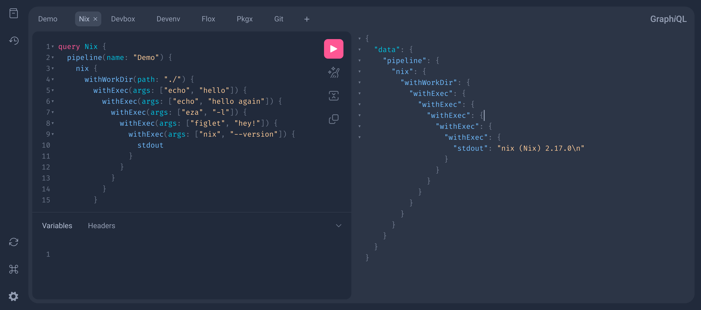

# FluentCI Engine

[](https://flakehub.com/flake/fluentci-io/fluentci-engine)
[](https://flakestry.dev/flake/github/fluentci-io/fluentci-engine)
[](https://crates.io/crates/fluentci-engine)
[](https://crates.io/crates/fluentci-engine)
[](https://github.com/fluentci-io/fluentci-engine/actions/workflows/ci.yml)
[](https://discord.gg/V4U6dPskKc)

FluentCI Engine is a programmable CI/CD engine that is designed to be simple, flexible, and easy to use. It is supposed to run on the host machine without containerization or virtualization, and it is designed to be used with [Nix](https://nixos.org), [Pkgx](https://pkgx.sh), [Devbox](https://www.jetpack.io/devbox/), [Flox](https://flox.dev), [Devenv](https://devenv.sh), [Pixi](https://pixi.sh/) and [Mise](https://mise.jdx.dev/).

> [!NOTE]
> **Project Status: 🐲 Unstable, alpha-ish quality.**
> This project is still in the early stages of development, 
> and it is not yet ready for production use. 
> It is not feature-complete, and it is not yet stable. Use at your own risk.

## ✨ Features

- [x] Simple and easy to use
- [x] Flexible
- [x] No containerization or virtualization
- [x] Built-in support for Nix, Pkgx, Devbox, Flox, Devenv, Mise and Pixi
- [ ] Cache support
- [x] SDK for writing pipelines in TypeScript, see [@fluentci/sdk](./sdk/typescript)
- [x] GraphQL API

## 🚀 Quick Start

```bash
# Clone the repository
git clone https://github.com/fluentci-io/fluentci-engine.git
# Go to the project directory
cd fluentci-engine serve
# Install dependencies
nix develop
cargo run -p fluentci-engine
# Open the browser and go to http://localhost:6880/graphiql
# See ./fixtures for some GraphQL queries examples
```

> [!TIP]
> Quickly setup Nix on your machine with [DeterminateSystems Nix installer](https://github.com/DeterminateSystems/nix-installer)